# Run Tekton Pipelines on Quay Image Mirroring Notifications

This demo shows an example of a Tekton Pipeline on OpenShift which is triggered based on webhooks from Quay image registry. A mirrored repository 
is configured on Quay to mirror images from Red Hat container catalog. As a result, every time a new image tag is made available in Red Hat container 
catalog, Quay would trigger the application build pipeline to rebuild the application image using the new base image, ensuring the application image 
carries the fixes for bugs, CVEs and vulnerabilities that are discovered in the base image. 

## Create image repositories in Red Hat Quay

Create a new organization in Quay and name id "demo"


Create a private image repository called `quarkus-app` for the [Quarkus](http://quarkus.io) application used in this demo: https://github.com/siamaksade/quarkus-app

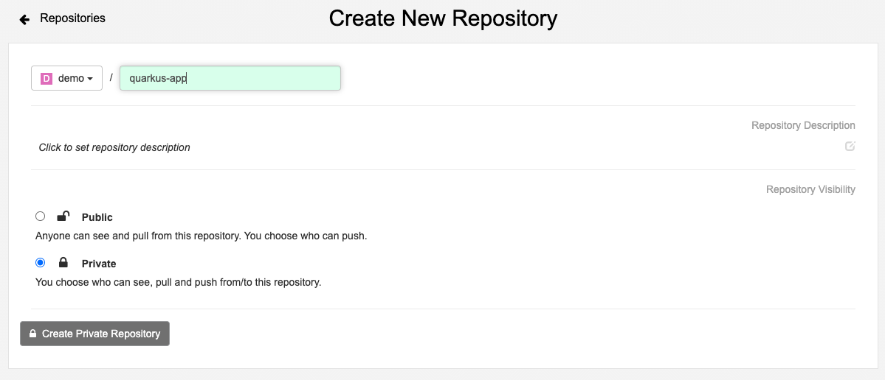

Create a private image repository called `rh-openjdk-11-runtime` for mirroring the OpenJDK 11 runtime image that is provided by the Red Hat container catalog (`registry.access.redhat.com/ubi8/openjdk-11-runtime`). This base image will be used for building the Quarkus application image: 

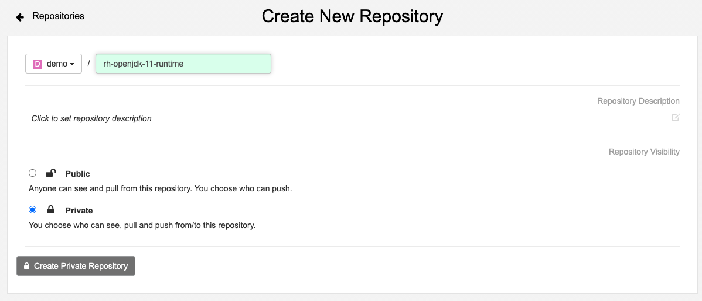


Create a Quay robot account called `ci` in the `demo` organization and give it *write* access to the application repository (`quarkus-app`) and *read* access to the base image repository (`rh-openjdk-11-runtime`):

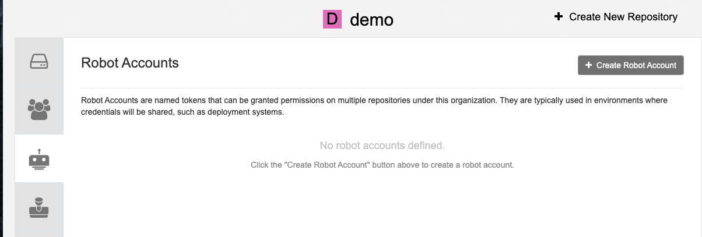
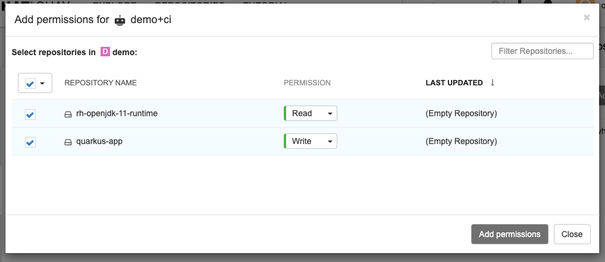

Download the Kubernetes secret containing the credentials for the `ci` robot account which is needed by the Tekton pipeline that needs to pull and push images from and to these private image repositories.

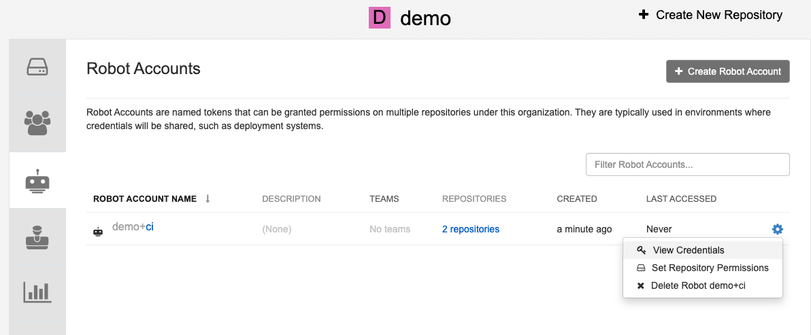
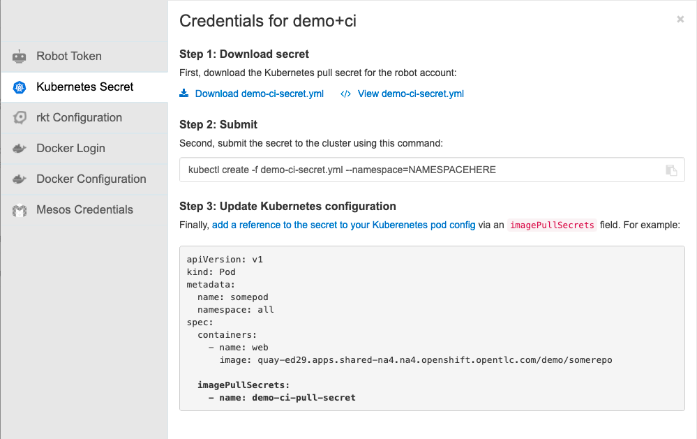

Rename the downloaded yaml for `ci` robot account credentials to `quay-auth-secret.yaml`.

## Configure Quay image mirroring from Red Hat container catalog

Go to the `rh-openjdk-11-runtime` image repository settings and change the *Repository State* to *Mirror*. 


Once done, the mirror settings appear in the left sidebar. 

Click on mirror settings and configure the mirroring as following:
* Location: `registry.access.redhat.com/ubi8/openjdk-11-runtime`
* tags: `*`
* Start date: *Now*
* Sync interval: 1 days
* Robot user: `demo+ci`
* verify TLS: *check*

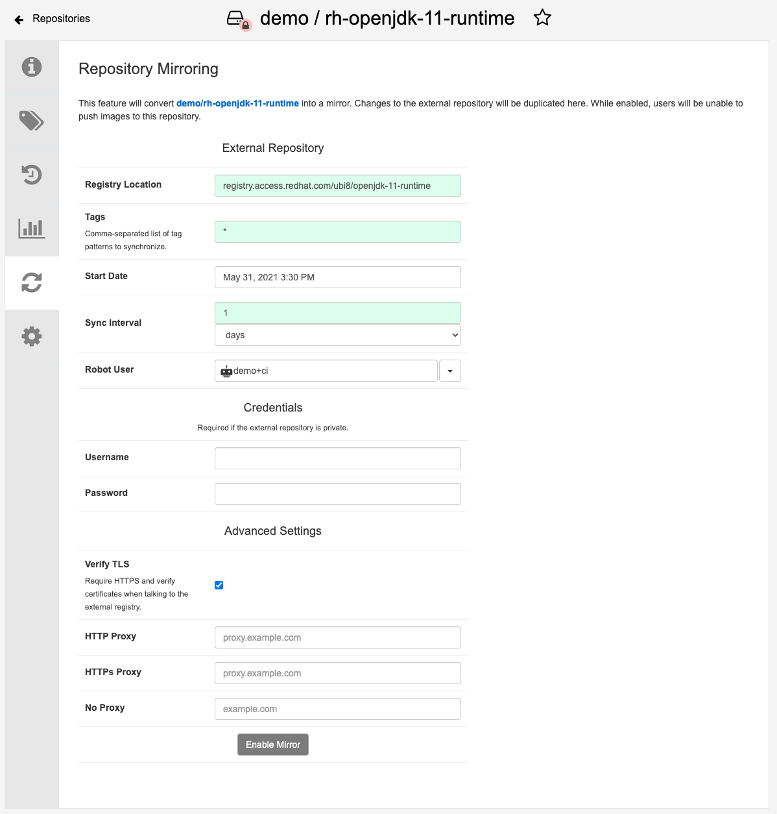

Click on **Enable Mirror**. The above configuration syncs the repository once every day. Click on **Sync** to start a manual sync right away. After the sync is complete, you would see the imported images and tags from Red Hat container catalog.

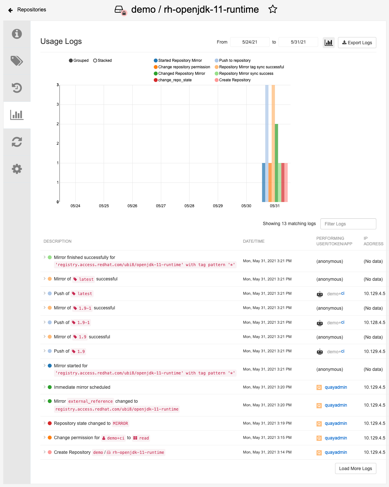
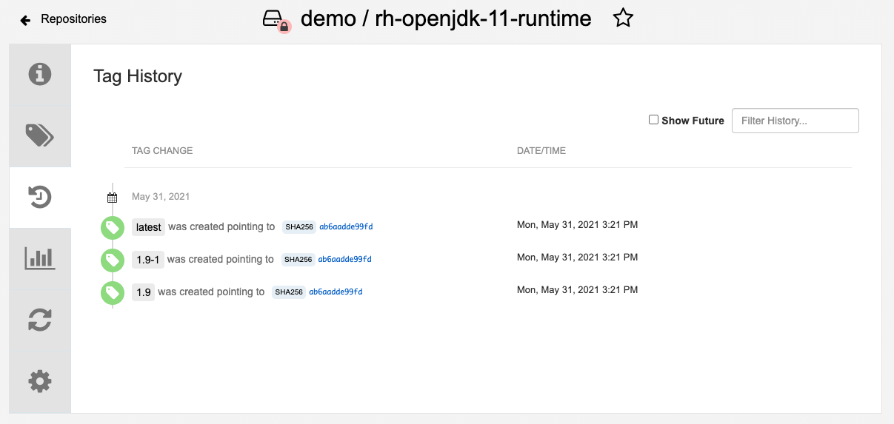

## Create Tekton pipeline and triggers for application build

This GitHub repository contains an example of a simple Tekton pipeline for building the [Quarkus app](https://github.com/siamaksade/quarkus-app) image using `buildah` and the `Dockerfile` that is provided in the application Git repository. The Quarkus app image is then pushed to the `quarkus-app` image repository on Quay.

Create a new project on OpenShift and then create the example Tekton pipeline from this GitHub repository. Before doing so, update [build-pipeline.yaml](pipeline/build-pipeline.yaml) with your Quay url in `APP_IMAGE_NAME` and `BASE_IMAGE_NAME` parameters default value:

```
$ oc new-project demo
$ oc create -f pipeline
```

Create the secret that was downloaded from Quay which contained the `ci` robot account credentials:

```
$ oc create -f quay-auth-secret.yml
```

The robot account credentials secret needs to be added to list of pull and push secrets of the service account that executes the Tekton pipeline. On OpenShift, the `pipeline` service account is used by default for executing the pipeline if none is provided explicitly. Run the following to update the `pipeline` service account pull and push secrets to contain the robot account secret:

```
$ oc apply -f secrets/pipeline-sa.yaml
```

Configure Tekton triggers to expose a webhook url that is aware of Quay notifications and can parse and consume the Quay payload whenever a new image tag is mirrored from the Red Hat container catalog:

```
$ oc create -f triggers
```

Go to OpenShift Web Console and in the developer perspective in *Pipelines* section of the `demo` namespace, you can see the build pipeline is available and ready to build the application images. Copy the webhook url for this pipeline which you can see under *TriggerTemplate* for the next step.

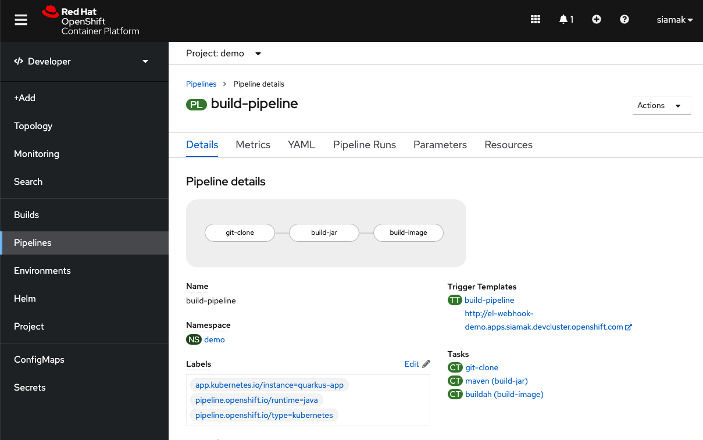

# Add Quay Notification to Start Pipeline

Go to the `rh-openjdk-11-runtime` image repository settings and create a *Notification*:
* Event: `Push to Repository` 
* Method: `Webhook Post`
* Webhook URL: *copy-paste from the pipeline details in OpenShift Web Console*
* Title: `Start Pipeline on Push`


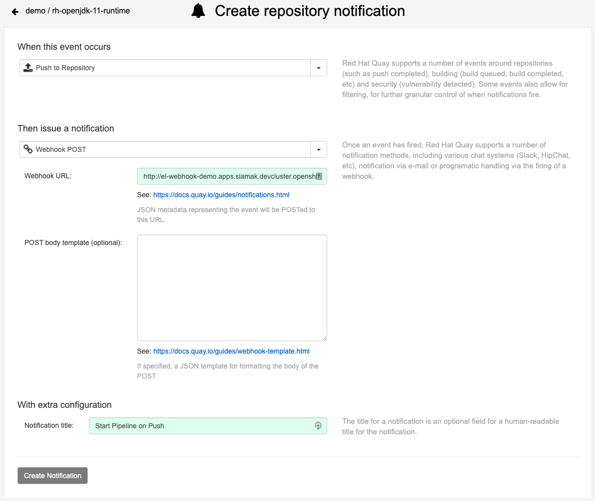


Now it's all set. Next time Quay syncs with the Red Hat container catalog, it will trigger the pipeline to rebuild the Quarkus app image with the tags that are synced. You can trigger a manual sync to test the notification like how you did in the previous steps.

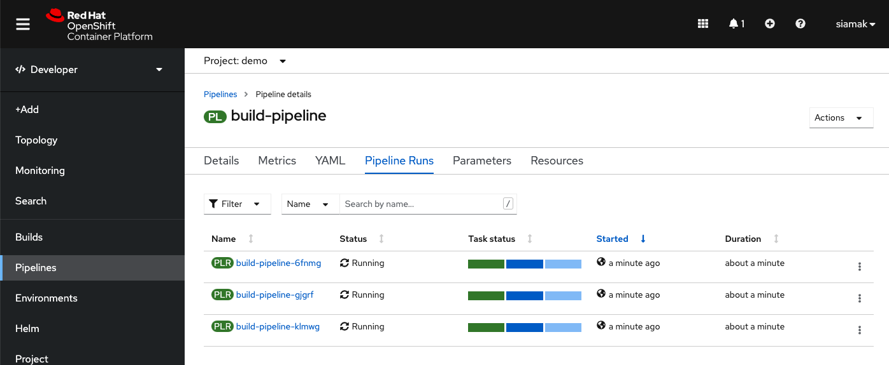

Note that Quay sends a webhook for every tag that is synced and therefore you would see a pipeline started for each tag of the base image. Therefore it is important to incorporate base image tags in the application image tags (e.g. `<app-version>-<base-image-verision>`) to avoid overwriting the application images. 